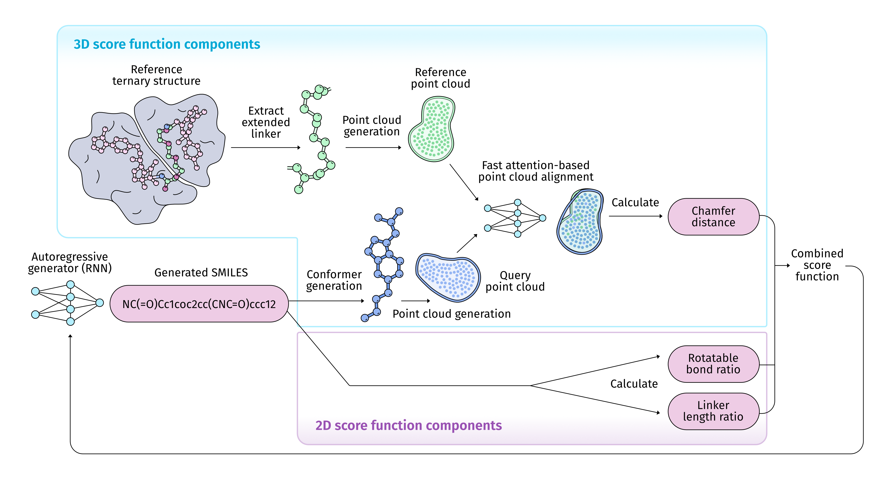

# ShapeLinker
[ShapeLinker](link_to_preprint) is a method for the shape-conditioned ***de novo*** linker design for PROTACs. It is based on [Link-INVENT](https://chemrxiv.org/engage/chemrxiv/article-details/62628b2debac3a61c7debf31) and uses reinforcement learning to steer the linker generation towards a query shape with desired physicochemical properties. Shape alignment is performed with a novel, fast attention-based point cloud alignment method.
<div style="width: 60%; height: 60%">

  

</div>

## Requirements
* Multi-parameter optimization using shape alignment requires two different conda environments (see below).
* Only works on Cuda-enabled GPU.
* The code was tested on Debian 10 only.

### Installation
1. Create ShapeLinker conda environment
```
conda env create -f env.yml
```
2. Create ```shape_align``` environment:
```
conda install -c conda-forge mamba
mamba create -n shape_align python=3.9 pytorch=1.13.0 torchvision pytorch-cuda=11.6 fvcore iopath nvidiacub pytorch3d -c bottler -c fvcore -c iopath -c pytorch -c nvidia -c pytorch3d
conda activate shape_align
pip install pykeops biotite open3d plyfile ProDy pykeops rdkit==2022.9.5 tqdm==4.49.0 unidip pytorch-lightning
pip install git+https://github.com/hesther/espsim.git
```

## Data
Download data and models from [the data storage](link). This data dump includes:

* folder ```data```
    * folder ```xtal_poses```: Processed and fragmented crystal structures
    * ```protacdb_extended_linkers.csv```: Processed PROTAC-DB data
    * ```pdb_systems_data.csv```: Processed data for the investigated crystal structures
* folder ```models```
    * ```protacdb_extlinker_model_align.pth```: Trained model for shape alignment
    * folder ```agents```: Trained RL agents for the different crystal structures

The Link-INVENT prior, which is needed for any RL run, can be accessed [here](https://github.com/MolecularAI/ReinventCommunity/blob/master/notebooks/models/linkinvent.prior).

Steps to get directory structure used in notebooks:
1. Store folder ```data``` in ```ShapeLinker/utils```
2. Store folder ```models``` in ```ShapeLinker```
3. Dump ```linkinvent.prior``` in ```ShapeLinker/models```

## Usage
The notebooks (folder ```ShapeLinker/notebooks```) used here were adapted from [ReinventCommunity](https://github.com/MolecularAI/ReinventCommunity) and help with preparing runs for RL or sampling. There is also a notebook to help with training a shape alignment model (```notebooks/train_shape_alignment_model.ipynb```). We recommend training a new model for poses different from the crystal structures investigated here (of which the extended linkers were used).

The folder ```utils/postprocessing``` contains more useful jupyter notebooks allowing the postprocessing and evaluation of the generated data.
